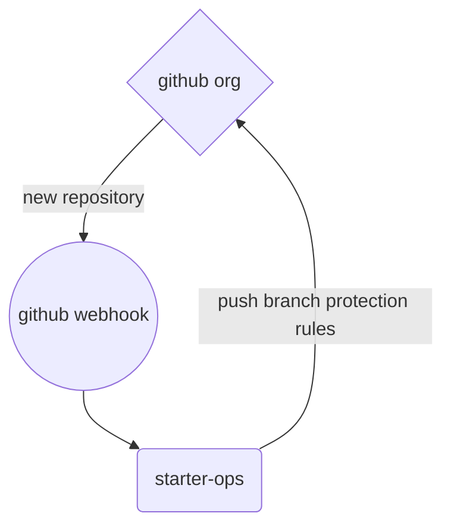

# starter-ops

__Note:__ _This repository contains example code and instructions meant to demonstrate specific functionality. It is published without warranty or guarantee._

## Contents
- [Overview](#overview)
- [Requirements](#requirements)
- [Usage](#usage)
- [Reference](#reference)
- [Suggested Enhancements](#suggested-enhancements)

## Overview

starter-ops is a small, [Flask](#)-based Python application which utilizes the [GitHub Rest API](#) in order to apply certain protection rules to newly-created branches within a specified organization. These protection rules can be summarized as follows:

- Require a pull request before merging
- No merges of pull requests allowed prior to at least 2 code reviews by code owners
- Automatic dismissal of existing reviews following new pull request commit(s)
- No teams or users are exempt; rules are enforced even for admins

In this example, the application is deployed to and hosted from the [Heroku](#) platform, and is triggered by [GitHub organization webhooks](#).

