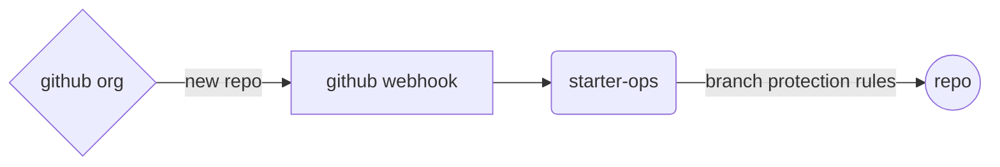
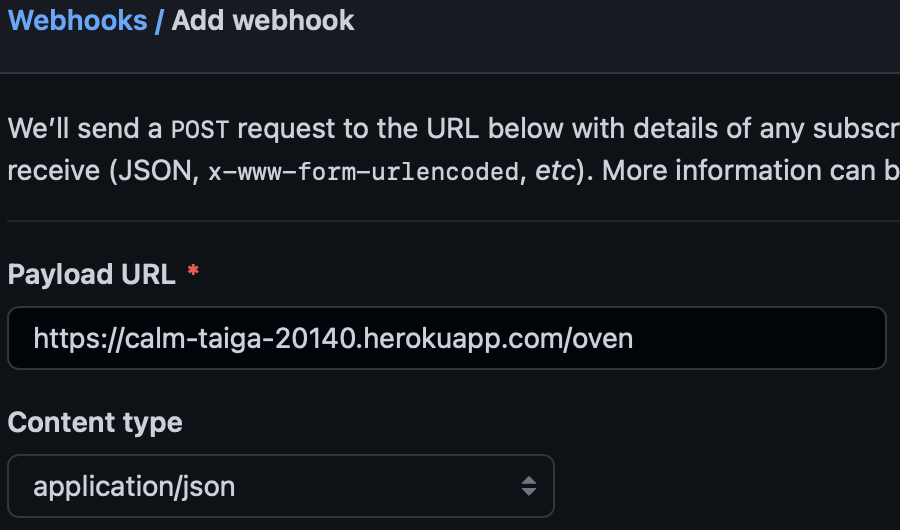
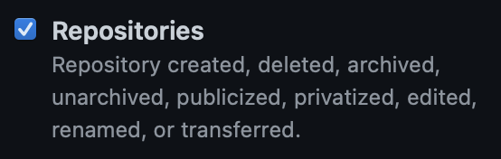
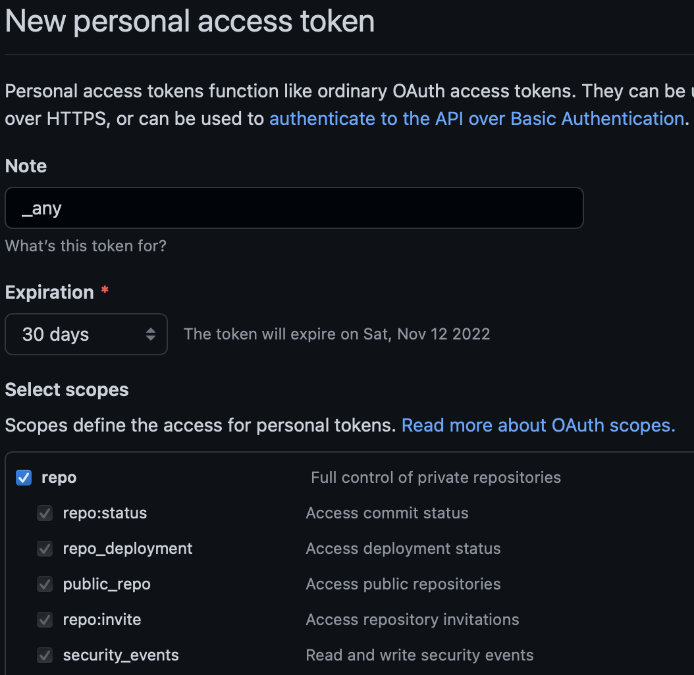

# starter-ops

__Note:__ _This repository contains example code and instructions meant to demonstrate specific functionality. It is published without warranty or guarantee. It is **NOT** secure and does very little input validation._

## Contents
- [Overview](#overview)
- [General Requirements](#general-requirements)
- [Configure and Deploy](#configure-and-deploy)
	- [Testing](#testing)
- [Usage](#usage)
	- [Existing Repositories](#existing-repositories)
- [Reference](#reference)
	- [Source Code](#source-code)
	- [Further Reading](#further-reading)
- [To Do](#to-do)

## Overview

starter-ops is a small, [Flask](https://flask.palletsprojects.com/en/2.2.x/)-based Python microservices application which utilizes the [GitHub Rest API](https://docs.github.com/en/rest) in order to apply certain default branch protection rules to newly-created repositories within a specified GitHub organization. These protection rules can be summarized as follows:

- Require a pull request before merging
- No merges of pull requests allowed prior to at least 2 code reviews by code owners
- Automatic dismissal of existing reviews following new pull request commit(s)
- No teams or users are exempt; rules are enforced even for admins

In this example, the application is deployed to and hosted from the [Heroku](https://www.heroku.com) platform and is triggered by [GitHub organization webhooks](https://docs.github.com/en/rest/orgs/webhooks). The logical flow of the design of this solution is roughly illustrated by the following diagram:



## General Requirements

- **[Git](https://git-scm.com/about)**
- **Python**: [Python 3.10.7](https://docs.python.org/3/whatsnew/changelog.html#python-3-10-7-final) was used in the development of this application. Required dependencies appear in the source code and are handled as part of the configuration and build process.
- **Heroku**: The application is built in and deployed on Heroku, therefore a [Heroku account](https://signup.heroku.com) is necessary.
- **Heroku CLI**: Interacting with the Heroku platform in order to build and deploy the application is done via the [Heroku CLI](https://devcenter.heroku.com/articles/heroku-cli)
- **GitHub**: The application addresses potential needs within the GitHub ecosystem, so [an account](https://github.com/join) with the following is necessary:
	- A GitHub [Organization](https://docs.github.com/en/organizations/collaborating-with-groups-in-organizations/creating-a-new-organization-from-scratch)
		- A GitHub [Webhook](https://docs.github.com/en/developers/webhooks-and-events/webhooks/creating-webhooks) configured for the organization
	- A GitHub [Personal Access Token](https://docs.github.com/en/authentication/keeping-your-account-and-data-secure/creating-a-personal-access-token)

_More detailed instructions follow in the next section_

## Configure and Deploy

As prerequisites, make sure that both [Git](https://git-scm.com/book/en/v2/Getting-Started-Installing-Git) and the [Heroku CLI](https://devcenter.heroku.com/articles/heroku-cli#install-the-heroku-cli) are installed.

The first step is to clone this repository locally:

```shell
➜ git clone git@github.com:tomsbakery/starter-ops.git
Cloning into 'starter-ops'...
remote: Enumerating objects: 183, done.
remote: Counting objects: 100% (183/183), done.
remote: Compressing objects: 100% (92/92), done.
remote: Total 183 (delta 88), reused 165 (delta 74), pack-reused 0
Receiving objects: 100% (183/183), 73.36 KiB | 715.00 KiB/s, done.
Resolving deltas: 100% (88/88), done.
```

_Note: all of the console operations from here on will be issued from within the 'starter-ops' local repository directory._

Next, log in to Heroku using the CLI:

```shell
➜ heroku login
```

This will open a browser window which prompts for login credentials.

After doing so, create a Heroku app which will contain the build of the application on the Heroku platform:

```shell
➜ heroku create
Creating app... done, stack is heroku-22
https://calm-taiga-20140.heroku.com/ | https://git.heroku.com/calm-taiga-20140.git
```

To trigger a build of the application within the app container, push the `starter-ops` source code to the `heroku` remote using `git`:

```shell
➜ git push heroku main
Enumerating objects: 9, done.
Counting objects: 100% (9/9), done.
Delta compression using up to 12 threads
Compressing objects: 100% (4/4), done.
Writing objects: 100% (5/5), 1.13 KiB | 1.13 MiB/s, done.
Total 5 (delta 2), reused 0 (delta 0), pack-reused 0
remote: Compressing source files... done.
remote: Building source:
remote:
remote: -----> Building on the Heroku-22 stack
remote: -----> Using buildpack: heroku/python
remote: -----> Python app detected
remote: -----> Using Python version specified in runtime.txt
remote:  !
remote:  !     A Python security update is available! Upgrade as soon as possible to: python-3.10.8
remote:  !     See: https://devcenter.heroku.com/articles/python-runtimes
remote:  !
remote: -----> Requirements file has been changed, clearing cached dependencies
remote: -----> Installing python-3.10.7
remote: -----> Installing pip 22.2.2, setuptools 63.4.3 and wheel 0.37.1
remote: -----> Installing SQLite3
remote: -----> Installing requirements with pip
remote:        Collecting Flask==2.2.2
remote:          Downloading Flask-2.2.2-py3-none-any.whl (101 kB)
remote:        Collecting gunicorn==20.1.0
remote:          Downloading gunicorn-20.1.0-py3-none-any.whl (79 kB)
remote:        Collecting requests==2.28.1
remote:          Downloading requests-2.28.1-py3-none-any.whl (62 kB)
remote:        Collecting Werkzeug>=2.2.2
remote:          Downloading Werkzeug-2.2.2-py3-none-any.whl (232 kB)
remote:        Collecting click>=8.0
remote:          Downloading click-8.1.3-py3-none-any.whl (96 kB)
remote:        Collecting Jinja2>=3.0
remote:          Downloading Jinja2-3.1.2-py3-none-any.whl (133 kB)
remote:        Collecting itsdangerous>=2.0
remote:          Downloading itsdangerous-2.1.2-py3-none-any.whl (15 kB)
remote:        Collecting certifi>=2017.4.17
remote:          Downloading certifi-2022.9.24-py3-none-any.whl (161 kB)
remote:        Collecting urllib3<1.27,>=1.21.1
remote:          Downloading urllib3-1.26.12-py2.py3-none-any.whl (140 kB)
remote:        Collecting charset-normalizer<3,>=2
remote:          Downloading charset_normalizer-2.1.1-py3-none-any.whl (39 kB)
remote:        Collecting idna<4,>=2.5
remote:          Downloading idna-3.4-py3-none-any.whl (61 kB)
remote:        Collecting MarkupSafe>=2.0
remote:          Downloading MarkupSafe-2.1.1-cp310-cp310-manylinux_2_17_x86_64.manylinux2014_x86_64.whl (25 kB)
remote:        Installing collected packages: urllib3, MarkupSafe, itsdangerous, idna, gunicorn, click, charset-normalizer, certifi, Werkzeug, requests, Jinja2, Flask
remote:        Successfully installed Flask-2.2.2 Jinja2-3.1.2 MarkupSafe-2.1.1 Werkzeug-2.2.2 certifi-2022.9.24 charset-normalizer-2.1.1 click-8.1.3 gunicorn-20.1.0 idna-3.4 itsdangerous-2.1.2 requests-2.28.1 urllib3-1.26.12
remote: -----> Discovering process types
remote:        Procfile declares types -> web
remote:
remote: -----> Compressing...
remote:        Done: 22.3M
remote: -----> Launching...
remote:        Released v58
remote:        https://calm-taiga-20140.herokuapp.com/ deployed to Heroku
remote:
remote: Starting November 28th, 2022, free Heroku Dynos, free Heroku Postgres, and free Heroku Data for Redis® will no longer be available.
remote:
remote: If you have apps using any of these resources, you must upgrade to paid plans by this date to ensure your apps continue to run and to retain your data. For students, we will announce a new program by the end of September. Learn more at https://blog.heroku.com/next-chapter
remote:
remote: Verifying deploy... done.
To https://git.heroku.com/calm-taiga-20140.git
   5104e59..c4b6ba7  main -> main
```

_Note: it is also possible to link the Heroku app container to the main branch of the code residing at the `origin` on GitHub, such that builds are triggered automatically whenever pushing to the `origin main`. How to do that is covered in the [Heroku documentation](https://devcenter.heroku.com/articles/github-integration)._

A URL has been produced by the operations thus far which will be used in order to configure what's needed in GitHub.

In the GitHub web UI, navigate to the **Settings** tab of the organization. Once there, in the left-hand navigation pane, there is **Webhooks**. Create a webhook with the following settings:

- **Payload URL**: _https://calm-taiga-20140.herokuapp.com/oven_
	- This is the `remote` URL in the output generated by `heroku create` with `oven` appended -- `oven` is the endpoint the webhook will call when new repositories are created.
- **Content type**: _application/json_
- **Which events would you like to trigger this webhook?** _Let me select individual events._
	- _Scroll down, place a tick next to `Repositories`_
- Finally, save/create the webhook





While in the GitHub web UI, create the Personal Access Token. Navigate to the **Developer settings** area of **Profile Settings**. From there, **Personal access tokens** on the left. [Here](https://github.com/settings/tokens) is a direct link.

Create a new token with the following settings:

- **Note**: _any_
- **Expiration**: _at least 30 days, subject to user discretion_
- **Select scopes**: _tick the box next to `repo` which will also select all of the sub-categories under `repo`_
- Create and save the PAT. Make sure to copy down the token value as it needs to be set in the Heroku app environment.



Back in the terminal session, use the Heroku CLI to set the necessary environment variables that the application uses:

```shell
➜ heroku config:set GH_USER_NAME=your_username \
GH_ORG_NAME=your_orgname \
GH_ACCESS_TOKEN=your_access_token
Setting GH_USER_NAME, GH_ORG_NAME, GH_ACCESS_TOKEN and restarting ⬢ calm-taiga-20140... done, v60
GH_ACCESS_TOKEN: your_access_token
GH_ORG_NAME:     your_orgname
GH_USER_NAME:    your_username
```

Finally, run the application in Heroku by issuing the following:

```shell
➜ heroku ps:scale web=1
Scaling dynos... done, now running web at 1:Free
```

The service is up!

### Testing

Run a few simple `curl` tests from a local machine and see if the responses match what is expected:

```shell
➜ curl https://calm-taiga-20140.herokuapp.com/
Hello
➜ curl https://calm-taiga-20140.herokuapp.com/test
["tomsbakery/starter-ops"]
```

These responses indicate both that (1) the application service is up and running and (2) it can communicate with the GitHub REST API using the credentials and organization provided in the environment.

Take a look at the Heroku logs:

```shell
➜ heroku logs --tail
2022-10-12T18:54:33.281877+00:00 heroku[web.1]: State changed from starting to up
2022-10-12T19:03:19.318803+00:00 app[web.1]: 10.1.13.70 - - [12/Oct/2022:19:03:19 +0000] "GET / HTTP/1.1" 200 5 "-" "curl/7.79.1"
2022-10-12T19:03:19.319576+00:00 heroku[router]: at=info method=GET path="/" host=calm-taiga-20140.herokuapp.com request_id=245bad3f-3c90-4a50-aaff-3442a1ee799b fwd="96.239.101.125" dyno=web.1 connect=0ms service=2ms status=200 bytes=157 protocol=https
2022-10-12T19:03:35.907484+00:00 app[web.1]: 10.1.52.141 - - [12/Oct/2022:19:03:35 +0000] "GET /test HTTP/1.1" 200 27 "-" "curl/7.79.1"
2022-10-12T19:03:35.909490+00:00 heroku[router]: at=info method=GET path="/test" host=calm-taiga-20140.herokuapp.com request_id=dd47a5f7-e885-4a6c-bd4f-409e6e8b7265 fwd="96.239.101.125" dyno=web.1 connect=0ms service=211ms status=200 bytes=172 protocol=https
```

Everything looks good so far.

## Usage

It's not as easy to test the `/oven` endpoint, which is the one listening for the webhook configured earlier. To confirm that this primary functionality of the application is working as expected, do two things in the GitHub web UI:

1. Create a new empty public repository within the organization
2. Create a new public repository within the organization with the option to include a default `README.md` file selected

In the first case, the application should commit a `README.md` to the repository, thereby creating a default branch, apply the branch protections in the repository branch settings, and then file an issue notifying the organization admin of actions taken with a summary of the branch protections.

In the second case, all of the same events should happen with the exception of the committal of a `README.md` file, as one will already be present along with a default branch.

These operations constitute the main usage of the application.
### Existing Repositories

For repositories that already exist under the organization which the same branch protections should be applied, the microservice exposes another endpoint, `/toaster`

This endpoint will apply the same actions described previously to a **single** repository, the owner and repository name being specified as URL parameters in a `GET` request to the endpoint. For example:

```shell
➜ curl https://calm-taiga-20140.herokuapp.com/toaster/tomsbakery/supreme-guacam
ole
{"code":"success","status":201}
```

The portion of the URL path following `toaster/` specifies the owner and repository name to work against i.e. `tomsbakery/supreme-guacamole`. This endpoint could be scripted against in a one-off fashion in order to apply the desired branch protection rules to repositories which already exist. The `/test` endpoint, which lists all repositories under the configured organization, might also aid in the development of such a script.

An example could look something like the following:

```shell
#!/usr/bin/env bash

toaster="https://calm-taiga-20140.herokuapp.com/toaster"
repos=("tomsbakery/demo1" "tomsbakery/demo2" "tomsbakery/demo3")

for repo in "${repos[@]}"; do
    curl -s "$toaster/repo"
    sleep 0.25
done
```

Where the `repos` array variable would have been constructed manually using the output of the `/test` endpoint, which lists all repositories in the organization. For hundreds or more, the script could be modified to take this input from a file rather than specified in the script itself, or even piped directly from the output of a `GET` request to the `/test` endpoint.

## Reference

### Source code

```shell
├── LICENSE
├── Procfile
├── README.md
├── ghrest
│   └── github.py
├── requirements.txt
├── runtime.txt
└── starter_ops.py
```

- `Procfile`: This is required by Heroku as a means of specifying to the service worker(s) what specific executable needs to be launched in order to serve the application.
	- See the [Heroku documentation on Procfile](https://devcenter.heroku.com/articles/procfile)
- `ghrest/github.py`: This source file contains a very simple interface to the [GitHub REST API](https://docs.github.com/en/rest) and is imported by `starter_ops.py`
- `requirements.txt`: This is required by Heroku as a means of specifying what Python dependencies are needed within the app container/build environment. It was generated by issuing `pipreqs . --force` while `import gunicorn` was also present in `starter_ops.py`. It was removed afterwards as `gunicorn` is not being used programmatically, rather as a WSGI server in front of Flask within the Heroku environment.
- `runtime.txt`: This is required by Heroku as a means of specifying which version of `python` should be used.
- `starter_ops.py`: This is where the main logic of the application resides, implemented using the Flask framework. It specifies 4 endpoints: `/`, `/test`, `/oven`, and `/toaster`

### Further Reading

Heroku
- [Getting Started on Heroku with Python](https://devcenter.heroku.com/articles/getting-started-with-python?singlepage=true)
- [The Heroku CLI](https://devcenter.heroku.com/articles/heroku-cli)
- [The Procfile](https://devcenter.heroku.com/articles/procfile)
- [Deploying Python Applications with Gunicorn](https://devcenter.heroku.com/articles/python-gunicorn)
- [Configuration and Config Vars](https://devcenter.heroku.com/articles/config-vars)
- [Heroku Error Codes](https://devcenter.heroku.com/articles/error-codes)

Flask
- [Deploying to Production Using Gunicorn](https://flask.palletsprojects.com/en/2.2.x/deploying/gunicorn/)

Gunicorn
- [Configuration Overview](https://docs.gunicorn.org/en/latest/configure.html)

## To Do

This application could benefit, greatly, from a variety of improvements. Some that come to mind:

- More and better data/input validation
- Securing endpoints with, at minimum, access tokens
- More and better error/exception handling
- Reasonable rate limiting