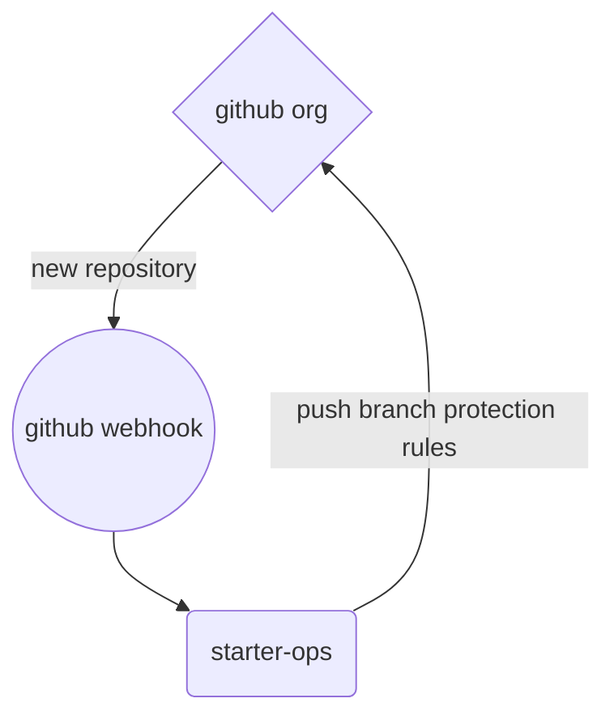

# starter-ops

__Note:__ _This repository contains example code and instructions meant to demonstrate specific functionality. It is published without warranty or guarantee. It is **NOT** secure._

## Contents
- [Overview](#overview)
- [General Requirements](#general-requirements)
- [Components and Configuration](#components-and-configuration)
	- [Heroku](#heroku)
	- [starter-ops](#starter-ops)
	- [GitHub Organization Webhook](#github-organization-webhook)
- [Usage](#usage)
	- [Existing repositories](#existing-repositories)
- [Reference](#reference)
- [To Do](#to-do)

## Overview

starter-ops is a small, [Flask](#)-based Python microservices application which utilizes the [GitHub Rest API](#) in order to apply certain default branch protection rules to newly-created repositories within a specified GitHub organization. These protection rules can be summarized as follows:

- Require a pull request before merging
- No merges of pull requests allowed prior to at least 2 code reviews by code owners
- Automatic dismissal of existing reviews following new pull request commit(s)
- No teams or users are exempt; rules are enforced even for admins

In this example, the application is deployed to and hosted from the [Heroku](#) platform and is triggered by [GitHub organization webhooks](#). The logical flow of the design of this solution is roughly illustrated by the following diagram:

## General Requirements

- **Python**: [Python 3.10.7](https://docs.python.org/3/whatsnew/changelog.html#python-3-10-7-final) was used in the development of this application. Required dependencies appear in the source code and are handled as part of the configuration and build process.
- **Heroku**: The application is built in and deployed on Heroku, so a [Heroku account](https://signup.heroku.com) is necessary.
- **Heroku CLI**: Interacting with the Heroku platform in order to build and deploy the application is done via the [Heroku CLI](https://devcenter.heroku.com/articles/heroku-cli)
- **GitHub**: The application addresses potential needs within the GitHub ecosystem, so [an account](https://github.com/join) with the following is necessary:
	- A GitHub [Organization](https://docs.github.com/en/organizations/collaborating-with-groups-in-organizations/creating-a-new-organization-from-scratch)
		- A GitHub [Webhook](https://docs.github.com/en/developers/webhooks-and-events/webhooks/creating-webhooks) configured for the organization
	- A GitHub [Personal Access Token](https://docs.github.com/en/authentication/keeping-your-account-and-data-secure/creating-a-personal-access-token)