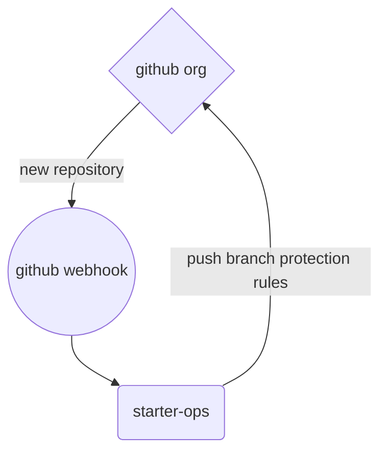

# starter-ops

__Note:__ _This repository contains example code and instructions meant to demonstrate specific functionality. It is published without warranty or guarantee. It is **NOT** secure._

## Contents
- [Overview](#overview)
- [General Requirements](#general-requirements)
- [Configure and Deploy](#configure-and-deploy)
- [Usage](#usage)
	- [Existing repositories](#existing-repositories)
- [Reference](#reference)
- [To Do](#to-do)

## Overview

starter-ops is a small, [Flask](#)-based Python microservices application which utilizes the [GitHub Rest API](#) in order to apply certain default branch protection rules to newly-created repositories within a specified GitHub organization. These protection rules can be summarized as follows:

- Require a pull request before merging
- No merges of pull requests allowed prior to at least 2 code reviews by code owners
- Automatic dismissal of existing reviews following new pull request commit(s)
- No teams or users are exempt; rules are enforced even for admins

In this example, the application is deployed to and hosted from the [Heroku](#) platform and is triggered by [GitHub organization webhooks](#). The logical flow of the design of this solution is roughly illustrated by the following diagram:



## General Requirements

- **[Git](https://git-scm.com/about)**
- **Python**: [Python 3.10.7](https://docs.python.org/3/whatsnew/changelog.html#python-3-10-7-final) was used in the development of this application. Required dependencies appear in the source code and are handled as part of the configuration and build process.
- **Heroku**: The application is built in and deployed on Heroku, therefore a [Heroku account](https://signup.heroku.com) is necessary.
- **Heroku CLI**: Interacting with the Heroku platform in order to build and deploy the application is done via the [Heroku CLI](https://devcenter.heroku.com/articles/heroku-cli)
- **GitHub**: The application addresses potential needs within the GitHub ecosystem, so [an account](https://github.com/join) with the following is necessary:
	- A GitHub [Organization](https://docs.github.com/en/organizations/collaborating-with-groups-in-organizations/creating-a-new-organization-from-scratch)
		- A GitHub [Webhook](https://docs.github.com/en/developers/webhooks-and-events/webhooks/creating-webhooks) configured for the organization
	- A GitHub [Personal Access Token](https://docs.github.com/en/authentication/keeping-your-account-and-data-secure/creating-a-personal-access-token)

_More detailed instructions follow in the next section_

## Configure and Deploy

As prerequisites, make sure that you have both [Git](https://git-scm.com/book/en/v2/Getting-Started-Installing-Git) and the [Heroku CLI](https://devcenter.heroku.com/articles/heroku-cli#install-the-heroku-cli) installed.

The first step is to clone this repository locally:

```shell
➜ git clone git@github.com:tomsbakery/starter-ops.git
Cloning into 'starter-ops'...
remote: Enumerating objects: 183, done.
remote: Counting objects: 100% (183/183), done.
remote: Compressing objects: 100% (92/92), done.
remote: Total 183 (delta 88), reused 165 (delta 74), pack-reused 0
Receiving objects: 100% (183/183), 73.36 KiB | 715.00 KiB/s, done.
Resolving deltas: 100% (88/88), done.
```

_Note: all of the operations from here on out will be issued from within the 'starter-ops' local repository directory._

Next, log in to Heroku using the CLI:

```shell
➜ heroku login
```

This will open a browser window which prompts you for your login credentials.

After you have done so, create a Heroku app which will contain the build of our application on the Heroku platform:

```shell
➜ heroku create
Creating app... done, stack is heroku-22
https://floating-dragon-42.heroku.com/ | https://git.heroku.com/floating-dragon-42.git
```

To trigger a build of our application within the app container, all we have to do is push our code to the `heroku` remote using `git`:

```shell
➜ git push heroku main
Enumerating objects: 9, done.
Counting objects: 100% (9/9), done.
Delta compression using up to 12 threads
Compressing objects: 100% (4/4), done.
Writing objects: 100% (5/5), 1.13 KiB | 1.13 MiB/s, done.
Total 5 (delta 2), reused 0 (delta 0), pack-reused 0
remote: Compressing source files... done.
remote: Building source:
remote:
remote: -----> Building on the Heroku-22 stack
remote: -----> Using buildpack: heroku/python
remote: -----> Python app detected
remote: -----> Using Python version specified in runtime.txt
remote:  !
remote:  !     A Python security update is available! Upgrade as soon as possible to: python-3.10.8
remote:  !     See: https://devcenter.heroku.com/articles/python-runtimes
remote:  !
remote: -----> Requirements file has been changed, clearing cached dependencies
remote: -----> Installing python-3.10.7
remote: -----> Installing pip 22.2.2, setuptools 63.4.3 and wheel 0.37.1
remote: -----> Installing SQLite3
remote: -----> Installing requirements with pip
remote:        Collecting Flask==2.2.2
remote:          Downloading Flask-2.2.2-py3-none-any.whl (101 kB)
remote:        Collecting gunicorn==20.1.0
remote:          Downloading gunicorn-20.1.0-py3-none-any.whl (79 kB)
remote:        Collecting requests==2.28.1
remote:          Downloading requests-2.28.1-py3-none-any.whl (62 kB)
remote:        Collecting Werkzeug>=2.2.2
remote:          Downloading Werkzeug-2.2.2-py3-none-any.whl (232 kB)
remote:        Collecting click>=8.0
remote:          Downloading click-8.1.3-py3-none-any.whl (96 kB)
remote:        Collecting Jinja2>=3.0
remote:          Downloading Jinja2-3.1.2-py3-none-any.whl (133 kB)
remote:        Collecting itsdangerous>=2.0
remote:          Downloading itsdangerous-2.1.2-py3-none-any.whl (15 kB)
remote:        Collecting certifi>=2017.4.17
remote:          Downloading certifi-2022.9.24-py3-none-any.whl (161 kB)
remote:        Collecting urllib3<1.27,>=1.21.1
remote:          Downloading urllib3-1.26.12-py2.py3-none-any.whl (140 kB)
remote:        Collecting charset-normalizer<3,>=2
remote:          Downloading charset_normalizer-2.1.1-py3-none-any.whl (39 kB)
remote:        Collecting idna<4,>=2.5
remote:          Downloading idna-3.4-py3-none-any.whl (61 kB)
remote:        Collecting MarkupSafe>=2.0
remote:          Downloading MarkupSafe-2.1.1-cp310-cp310-manylinux_2_17_x86_64.manylinux2014_x86_64.whl (25 kB)
remote:        Installing collected packages: urllib3, MarkupSafe, itsdangerous, idna, gunicorn, click, charset-normalizer, certifi, Werkzeug, requests, Jinja2, Flask
remote:        Successfully installed Flask-2.2.2 Jinja2-3.1.2 MarkupSafe-2.1.1 Werkzeug-2.2.2 certifi-2022.9.24 charset-normalizer-2.1.1 click-8.1.3 gunicorn-20.1.0 idna-3.4 itsdangerous-2.1.2 requests-2.28.1 urllib3-1.26.12
remote: -----> Discovering process types
remote:        Procfile declares types -> web
remote:
remote: -----> Compressing...
remote:        Done: 22.3M
remote: -----> Launching...
remote:        Released v58
remote:        https://calm-taiga-20140.herokuapp.com/ deployed to Heroku
remote:
remote: Starting November 28th, 2022, free Heroku Dynos, free Heroku Postgres, and free Heroku Data for Redis® will no longer be available.
remote:
remote: If you have apps using any of these resources, you must upgrade to paid plans by this date to ensure your apps continue to run and to retain your data. For students, we will announce a new program by the end of September. Learn more at https://blog.heroku.com/next-chapter
remote:
remote: Verifying deploy... done.
To https://git.heroku.com/calm-taiga-20140.git
   5104e59..c4b6ba7  main -> main
```

_Note: it is also possible to link the Heroku app container to the main branch of your code residing in  at the `origin` on GitHub so that builds are triggered automatically whenever pushing to the `origin main`. How to do that is covered in the [Heroku documentation](https://devcenter.heroku.com/articles/github-integration)._

Now we have some values produced which we can use in order to configure what's needed in GitHub.

Navigate to the **Settings** tab of your organization. Once there, in the left-hand navigation pane, you will see **Webhooks**. Create a webhook with the following settings:

- **Payload URL**: _https://calm-taiga-20140.herokuapp.com/oven_
	- This is the `remote` URL in the output generated by `heroku create` with `oven` appended -- `oven` is the endpoint we want the webhook to call when new repositories are created.
- **Content type**: _application/json_
- **Which events would you like to trigger this webhook?** _Let me select individual events._
	- _Scroll down, place a tick next to `Repositories`_
- Finally, save/create the webhook

While we're in the GitHub web UI, we can also create our Personal Access Token at this time. Navigate to the **Developer settings** area of your **Profile Settings**. From there, you will see **Personal access tokens** on the left. [Here](https://github.com/settings/tokens) is a direct link.

Create a new token with the following settings:

- **Name**: _any_
- **Expiration**: _at least 30 days, subject to user discretion_
- **Select scopes**: _tick the box next to `repo` which will also select all of the sub-topics under `repo`_
- Create and save the PAT. Make sure to copy down the token value as we will need to set it in the Heroku environment next.